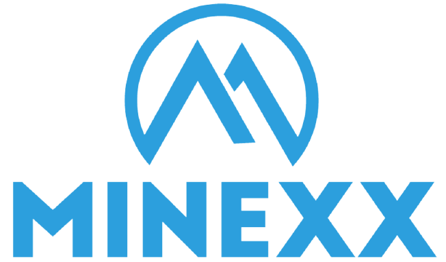

# MNEX Security Token
**3rd Year Group Project**
**Minexx 🇷🇼🇿🇦| Imperial College London 🇬🇧**

## Overview

The MNEX security token and the [minexx.codes](minexx.codes) webpage are the outcome of a exciting collaboration between students from Imperial College London and [Minexx](minexx.co), a startup working to revolutionize the Artisinal Mining Industry in Africa.

This repository contains all materials, sources, specifications and rationales necessary to understand and take over the project.

The content is structured as follows:

+ **Smart Contract**
  + This folder contains a video demonstration of our smart contract, its source code as well as documents on general blockchain and security tokens, technical documentation for the smart contract as well as its tests logging file.
+ **Webpage**
  + The [docs](docs) folder contains all content and source code for our webpage, [minexx.codes](minexx.codes). Pushing any changes to this folder will directly update the webpage.
+ **Reports**
  + This folder contains an in-depth report of the [Design History](https://github.com/crsren/minexx/blob/main/Reports/Design%20History.pdf), discussing the entire process from ideation to development and explaining any decisions that we made along the way.
  + It also contains two reports discussing our thoughts on the sustainability and ethic consequences of our work.
+ **Commercial files**
  + We have made a leaflet as well as an investor pitch for our project. Aside from that, this folder contains logos and other commercial assets that will be useful in the future.
+ **Project Organization**
  + This folder shows how we organized our project, containing our meeting records and an explanation of the project development methodology and tools we used, among others.
+ **Sources**
  + We uploaded any source documents we found useful here, organized according to 4 topics:
    + Minexx
    + Artisanal and Small-Scale Mining (ASM)
    + Impact Investment funds (IIF)
    + Blockchain & Security Tokens
  + Please note, any website sources used (as in not documents in themselves) are linked at the bottom of the text that references them.
