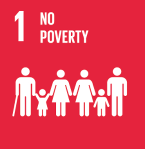
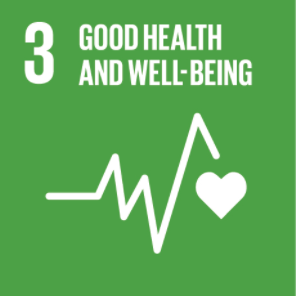
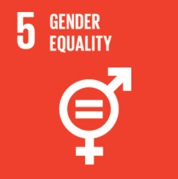
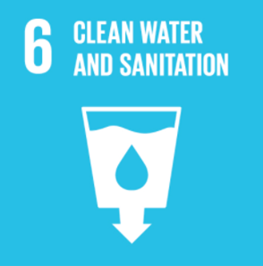
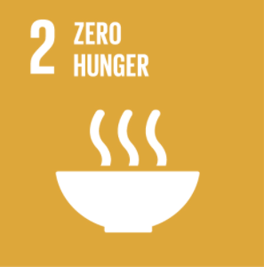
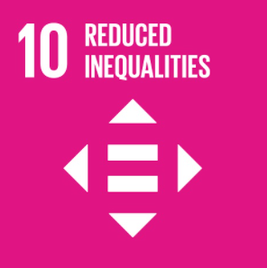
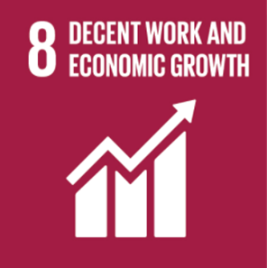
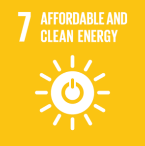
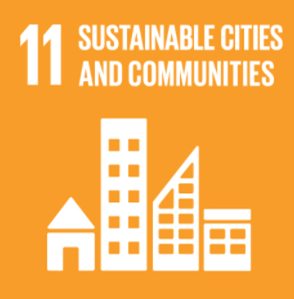

# Sustainability report

As a testament to our sustainability Minexx directly impacts 10 of the 17 Sustainable Development Goals set by the UN.

The first being to end poverty. This goal is met through Minexx providing the miners with an opportunity for a fair wage, preventing them from being under paid for the minerals they collect. This allows the miners to live more sustainable lives e.g. not having to sacrifice their child’s education for food.

A second goal being met is good health and well-being. This is being met by Minexx through their ATIF, as this will allow the miners to purchase safety equipment and reliable tools, it will also fund development of the mine sites providing amenities such as water and electricity. This brings sustainability as it will lead to much fewer miners getting injured or falling ill due to their work.

Another goal being met is gender equality. This is being met by Minexx through their commitment that male and female miners will be paid equally. This will be enforced through the miners being paid according to the quantity and quality of the minerals they have collected.

Clean water and sanitation. This is being met also through the ATIF which funds investment in the mine site areas. Thus, providing the miners with the essential commodities that they need. Promoting sustainability through improving the facilities around the mine sites.

Ending hunger is a goal being met by Minexx through their commitment to provide the miners with fairer wages that better reflect the importance of their work to the modern world.  

Reduced inequalities is being met in a similar way to gender equality. Minexx’s MineSmart platform will ensure equality as the miners will be paid based off the minerals that they collect without any bias. Meeting this goal in turn promotes sustainable communities. 

Decent work and economic growth are a goal being met by Minexx through their work to bring transparency to the supply chain. This will lead to the miners getting a better wage for example if the money spent on the raw materials of an $800 smartphone were doubled from $1 to $2, then the miners wages would double as well drastically improving their livelihoods.

Affordable and clean energy is a goal being met by Minexx through the ATIF providing the opportunity for big investors to fund the development of the mine sites. This will allow for the miners to have access to electricity and build more sustainable sites.

Sustainable cities and communities is also being met by Minexx in a similar way to the affordable and clean energy goal. The ATIF allows for investment into the mine sites creating sustainable communities in turn improving the livelihoods of the miners, their families and the people they support.  

Responsible consumption and production is the final goal being met. This is one of the core aims of Minexx with their plan to bring clarity to the mineral supply chain, meaning that tech companies can confidently claim that the raw materials in their products are ethically sourced. 

The software base of the project lends itself to sustainability as the website and smart contract can continuely be updated.
