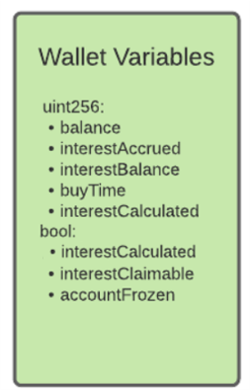

# Smart Contract Implementation

The following section goes into detail about the technical aspects of the final smart contract that was coded on the Ethereum blockchain. The functions within the smart contract are divided up into three groups, in accordance with the permissions that are set on the functions within those groups. The documentation will first cover the structure of the accounts that are held within the smart contract, and then go into detail about the functions and how they change the state of the accounts in various ways.

**State Variables**

State variables in Solidity are values that are permanently stored in smart contract storage. These variables can have access classifiers attached to them, which determine who on the blockchain is able to see the values of these variables. The designed smart contract uses a number of state variables in order to hold information about stakeholders and their permissions in the security token.

**Mappings**

In order to link an individual's wallet addresses with various pieces of data that are required for the operation of the security token, mappings are the primary data structure used within the smart contract. It is common practice to use mappings in Solidity when associating data with specific addresses [1]. The smart contract stores a number of mappings, relating to the investors and the regulatory bodies. 

Mappings in solidity can be seen as virtually initialized hash tables, in which every possible key (address in our case) exists, and each key is mapped to a value of 0 [2], unless stated otherwise on initialization (or later on). The defined mappings are as follows:

<table>
  <tr>
   <td><strong>Mapping Name</strong>
   </td>
   <td><strong>Data Types</strong>
   </td>
  </tr>
  <tr>
   <td>whitelistedInvestors
   </td>
   <td>address => bool
   </td>
  </tr>
  <tr>
   <td>regulatoryBodies
   </td>
   <td>address => bool
   </td>
  </tr>
  <tr>
   <td> accounts
   </td>
   <td>address => wallet
   </td>
  </tr>
</table>

* _wallet_ is a structure defined in the smart contract, its details are covered in the next subsection

The whitelistedInvestors mapping refers to whether a specific address has been added to the whitelist by Minexx, after they have gone through the KYC/AML verification that has been explained in other sections of the documentation. Only whitelisted investors will have access to interact with the functions under the “Investors” group as described below, for example buying tokens and claiming interest. 

The regulatoryBodies mapping refers to whether a specific address has been added to the list of approved regulatory bodies, again by Minexx. Like the whitelisted investors being provided access to the functions within the “Investors” group, addresses that have been set to true in the regulatoryBodies mapping will have access to the functions within the “Regulatory Bodies” group below.

Finally, the _accounts_ mapping allows the smart contract to link each address with a number of variables that are encapsulated inside a own-defined structure called _wallet_. Details of the variables that make up the _wallet_ structure will be explained below.

**Other State Variables**

The other state variables, along with their data type and brief summary of what they are used for, is described in the table below:

<table>
  <tr>
   <td><strong>Variable Name</strong>
   </td>
   <td><strong>Data Type</strong>
   </td>
   <td><strong>Explanation</strong>
   </td>
  </tr>
  <tr>
   <td>Minexx
   </td>
   <td>address (payable) 
   </td>
   <td>The variable that stores the Ethereum address that initially deploys the smart contract. Certain functions can only be called from this account.
   </td>
  </tr>
  <tr>
   <td>monthlyInterestRate
   </td>
   <td>uint256
   </td>
   <td>The value of the interest that investors will receive for that month.
   </td>
  </tr>
  <tr>
   <td>tokensAvailable
   </td>
   <td>uint256
   </td>
   <td>The total number of tokens that the Minexx account still has available for purchase after a funding round (where they mint new tokens).
   </td>
  </tr>
  <tr>
   <td>totalTokenSupply
   </td>
   <td>uint256
   </td>
   <td>The total number of tokens that have been supplied (hence the total value of the fund).
   </td>
  </tr>
  <tr>
   <td>MONTH_IN_SECONDS
   </td>
   <td>uint256
   </td>
   <td>(Not a variable, but a constant.) All time is expressed in seconds in solidity, hence this constant is stored so that it can be used to calculate if an individual is owed interest or not.
   </td>
  </tr>
</table>

**Wallet/Accounts Structure**

Within the _accounts_ mapping, each investor’s address is linked to one _wallet_ structure. The _wallet_ structure holds a number of key pieces of data that tell the smart contract about the value of security tokens in that account, as well as aiding in the calculation and distribution of interest payments to that account. As seen in the figure on the right, the types of variables are split into numeric values, as uint256’s, and boolean variables. The decision to use uint256 for the numerical values is explained in the Design History section.

The list of each of the variables along with the explanation for each one is as follows:

<table>
  <tr>
   <td><strong>Variable Name</strong>
   </td>
   <td><strong>Data Type</strong>
   </td>
   <td><strong>Explanation</strong>
   </td>
  </tr>
  <tr>
   <td>balance
   </td>
   <td>uint256
   </td>
   <td>The balance of security tokens accredited to that particular investor/address.
   </td>
  </tr>
  <tr>
   <td>interestAccrued
   </td>
   <td>uint256
   </td>
   <td>The value of interest that will be receivable at the end of the interest holding period (that month), based upon the value in <em>balance </em>and the<em> monthlyInterestRate. </em>This interest has not yet been claimed.
   </td>
  </tr>
  <tr>
   <td>interestBalance
   </td>
   <td>uint256
   </td>
   <td>The value of interest that has been claimed from the <em>interestAccrued </em>balance, after the interest holding period has ended. This balance is then redeemable for either cash, or to be reinvested in the next Minexx funding round. The reason for having a separate interest balance is explained in the Design History section earlier.
   </td>
  </tr>
  <tr>
   <td>buyTime
   </td>
   <td>uint256
   </td>
   <td>The timestamp of the block on which the purchase of the tokens took place. This is used, along with the constant <em>MONTH_IN_SECONDS </em>in order to determine whether the interest is claimable yet or not.
   </td>
  </tr>
  <tr>
   <td>interestCalculated
   </td>
   <td>bool
   </td>
   <td>This variable states whether the account has had its interest calculated and placed in the <em>interestAccrued</em> balance yet for the current month. It prevents users from continuously calculating interest before the month has passed. 
   </td>
  </tr>
  <tr>
   <td>interestClaimable
   </td>
   <td>bool
   </td>
   <td>This variable states whether the month long interest holding period has passed yet, and therefore whether the investor is able to claim their interest from their i<em>nterestAccrued </em>balance into their <em>interestBalance</em>.
   </td>
  </tr>
  <tr>
   <td>accountFrozen
   </td>
   <td>bool
   </td>
   <td>This variable is set to false all the time, except for when a regulatory body has frozen the assets in an individual’s account, as explained within the Final Design Overview. When frozen, the investor is not able to buy, receive nor transfer the tokens in their account, nor can they claim interest on their security tokens.
   </td>
  </tr>
</table>

**Smart Contract Functions**

As mentioned earlier, the functions that are callable by interacting with the smart contract are grouped into three sections, based upon which parties have permissions to call them. These sections are: Minexx, Investors and Regulatory Bodies. The addresses that are provided with the valid permissions to call functions in the Investors and Regulatory Bodies groups are ones that have been added by the Minexx account to _whitelistedInvestors_ and _regulatoryBodies_, respectively. 

There is only one address that has the permissions for the Minexx functions, and this address is conveniently named _Minexx_, as described in the Other State Variables section above. This _Minexx_ variable is set when the smart contract is initially deployed to the Ethereum blockchain, and it is set to the deployer’s address in a _constructor()_ function. In Solidity, you can only define one _constructor()_ function per contract and it will only be invoked once, at the time of initial deployment of the contract [3]. By recording the address that is sending the transaction that deploys the contract, we can store it in this variable, and use that for certain permissions.

**Minexx**

The following is a list of all the functions that are only callable if the transaction calling the functions originates from the _Minexx_ address:

<table>
  <tr>
   <td><strong>Function Name</strong>
   </td>
   <td><strong>Inputs</strong>
   </td>
   <td><strong>Explanation</strong>
   </td>
  </tr>
  <tr>
   <td>addToWhitelist()
   </td>
   <td>address
   </td>
   <td>Adds investor address to whitelist, after KYC/AML verification has been completed.
   </td>
  </tr>
  <tr>
   <td>addToRegBods()
   </td>
   <td>address
   </td>
   <td>Adds address to the regulatory body list, allowing that address to freeze or force transfer security token assets.
   </td>
  </tr>
  <tr>
   <td>mintNewTokens()
   </td>
   <td>valueMinted
   </td>
   <td>Allows Minexx to mint new tokens - this happens every time Minexx wants to increase the size of the fund (e.g. if the fund is of size $5million, but they have scoped out new projects and require an extra $5million to fund them, they will mint another 5 million tokens).
   </td>
  </tr>
  <tr>
   <td>setInterestRate()
   </td>
   <td>interestRate
   </td>
   <td>Allows the Minexx Investment Committee to set the monthly interest rate for investors, based on the different pieces of information described in Final Design Overview.
   </td>
  </tr>
</table>

The _mintNewTokens() _triggers an **event** that is published whenever the function is called successfully (i.e. by the Minexx account). These events are inheritable members of the contract, which store the arguments passed in the transaction logs when emitted (hence the value of tokens minted [4]. It is possible for applications to “listen” on the blockchain for these specific events - each time the event is emitted, the application is notified about the change in state (state change being the total supply of tokens/ tokens available). This allows the applications to execute dependent logic, for example automatic reinvestment of the interest balance. 

**Investors**

The following is a list of all the functions that are only accessible if the sender’s address is mapped to a true value in _whitelistedInvestors_ (as long as the sender’s account has not been frozen). The diagram shows a few more functions, each with an output, but in reality these are not functions but actually public state variables, meaning anyone interacting with the blockchain is able to see these values (e.g. the monthly interest rate, the number of tokens available). They have been grouped into the Investors part of the diagram as they would only ever be used by current or potential investors:

<table>
  <tr>
   <td><strong>Function Name</strong>
   </td>
   <td><strong>Inputs</strong>
   </td>
   <td><strong>Explanation</strong>
   </td>
  </tr>
  <tr>
   <td>buyTokens()
   </td>
   <td>capitalSent
   </td>
   <td>This function is used by investors to purchase tokens from Minexx (on the primary market). Technically, in the Solidity implementation on Ethereum, the input <em>capitalSpent</em> is not actually an argument, but a value of Ether that is sent along with the call to the <em>buyTokens()</em> function in the same transaction. 
   </td>
  </tr>
  <tr>
   <td>calculateInterestOwed()
   </td>
   <td>n/a
   </td>
   <td>This function calculates the interest that will be owed to the investor and places it in the wallet’s <em>interestAccrued</em> value, based on the <em>monthlyInterestRate</em> state variable and the wallet’s security token <em>balance</em>. It also sets the wallet’s boolean value <em>interestCalculated</em> to true for the month, meaning that the investor cannot go along and constantly to add interest to their <em>interestAccrued </em>value if they already have for that month. 
   </td>
  </tr>
  <tr>
   <td>checkIfClaimable()
   </td>
   <td>n/a
   </td>
   <td>This function uses the wallet’s <em>buyTime </em>value as well as the <em>MONTH_IN_SECONDS </em>constant to determine whether to set the wallet’s <em>interestClaimable </em>boolean value, in accordance with whether their interest holding period has ended yet. 
   </td>
  </tr>
  <tr>
   <td>claimInterest()
   </td>
   <td>n/a
   </td>
   <td>This function moves the value stored by the wallet’s <em>interestAccrued</em> variable into the <em>interestBalance</em> value, depending on whether the wallet’s <em>interestClaimable </em>boolean value is true or not. From there is is possible to redeem the <em>interestBalance</em> for cash or choose (with Minexx) to reinvest the balance during the next funding round.
   </td>
  </tr>
  <tr>
   <td>transfer()
   </td>
   <td>address, value
   </td>
   <td>This function allows a simple transfer between two whitelisted investors’ accounts, triggered by the sending account. This function is used when selling tokens on the secondary market, with the respective payment that goes along with it processed by the secondary market provider. The interest that has been accrued (but not yet claimed) on the tokens that are sent is also transferred to the recipient of the tokens. More information as to how this is done is described below the table.
   </td>
  </tr>
  <tr>
   <td>redeemInterest()
   </td>
   <td>n/a
   </td>
    <td> This function allows investors who have claimed interest into their <em>interestBalance</em> to redeem that interest for cash. This emits an event that will trigger Minexx to pay the investor what they are owed, either in cash or in a stablecoin alternative.
   </td>
  </tr>
</table>

In order to correctly transfer the interest accrued on the tokens that are sent from one investor to another using the _transfer()_ function, there was a balance that needed to be made. This balance was described earlier, in the Technical Design History/Challenges section, but it was between the ability to accurately store and send the information as to exactly which tokens have their interest holding period ending on certain dates, and the transaction fees (gas cost) associated with those transactions. The more complicated the transaction (for example sending data on the exact holding period for each individual token), the more one would need to pay in transaction fees. Due to the high gas costs that were being incurred on these types of transactions, it was decided that a simpler approach would be used.

The calculation of the interest that must be sent to the recipient was not difficult, all that must be calculated is the portion of tokens that are being sent out of the total token balance of the sender’s wallet. This portion was then multiplied by the value that is stored in the sender’s wallet’s _interestAccrued_ balance. The difficulty came with deciding how the recipient’s holding period should be changed. The solution that was decided on in the end was to essentially have the recipient’s wallet’s _buyTime_ variable be updated with the later of the two values of the sender and the current value. This means that the recipient will essentially just inherit the holding period end date from the sender if it is later than their own, ensuring that they are not able to claim the extra interest before the holding period is up.

**Regulatory Bodies**

Similar to the table above, this table describes some permissioned functions, but accessible only by addresses that have their mapping in _regulatoryBodies _set to true:

<table>
  <tr>
   <td><strong>Function Name</strong>
   </td>
   <td><strong>Inputs</strong>
   </td>
   <td><strong>Explanation</strong>
   </td>
  </tr>
  <tr>
   <td>freezeAssets()
   </td>
   <td>address
   </td>
   <td>As explained in Final Design Overview, this function is required in order to qualify the security token as a valid security. Freezing an investor’s account will prevent it from being able to access the functions in the Investor table above.
   </td>
  </tr>
  <tr>
   <td>forceTransfer()
   </td>
   <td>address1, address2, value 
   </td>
   <td>If an individual who has had their account frozen by a regulatory body, is found guilty of their charge or is forced to pay a fine/taxes by the legal authority in their country, as a last resort, the regulatory body is able to force transfer these assets out of that individual’s account. <em>address1 </em>refers to the sanctioned investor, from which the <em>value </em>of tokens are being transferred, and <em>address2 </em>will receive said <em>value </em>of tokens. These inputs are set by the regulatory body, depending on the legal case.
   </td>
  </tr>
</table>

---
**References**

[1] [Solidity - Solidity Language Documentation](https://docs.soliditylang.org/en/v0.5.3/types.html)

[2] [Medium - Mappings in Solidity](https://medium.com/upstate-interactive/mappings-in-solidity-explained-in-under-two-minutes-ecba88aff96e)

[3] [GeeksforGeeks - Solidity Constructors](https://www.geeksforgeeks.org/solidity-constructors/)

[4] [GeeksforGeeks - What are Events in Solidity?](https://www.geeksforgeeks.org/what-are-events-in-solidity/)

